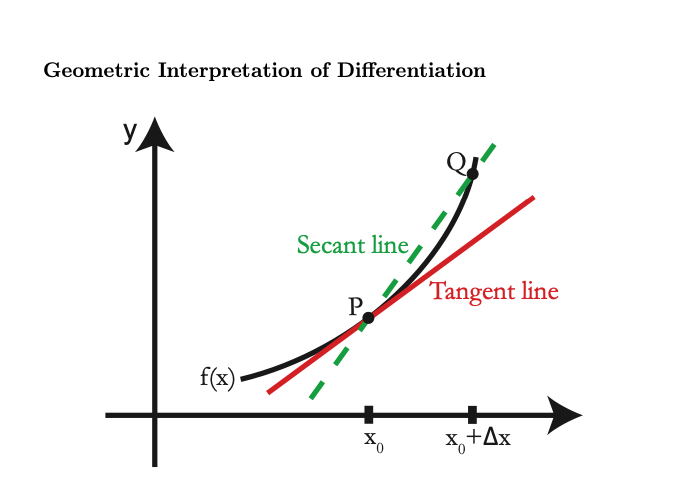
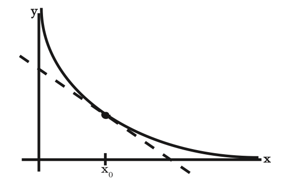

# Session 1-2

## Outline
这两个章节的内容比较的简单易懂。需要搞明白的概念如下： 

- 什么是导数，在几何意义上，在物理意义上以及导数对所有方法的重要性？
  - 在几何意义上,表示函数曲线在点$P_0(x_0,f(x_0))$处的切线的斜率。
  - 在物理意义上,一阶导数的物理意义:切线斜率变化的速度,表示的是一阶导数的变化率。
- 如何对任何数求导呢？
  - 参考第三与第四点。
- 什么是"tangent line"? 什么是"secant line"?
  - 参考第二点。
## 1.What is a derivative?

- geometric interpretation
- physical interpretation
- Importance of derivatives to **all** measurements

## 2.How to differentiate anything?

$\frac{dy}{dx} e^{xtanx} =?$

## 3.Geometric Interpretation

Finding the **tangent line(切线)** to $y = f(x)$  at $P = (x_0,y_0)$

Tangent line = limit of secant line PQ as Q -> P(P is fixed) 

Tangent Line: 过圆上一点且垂直与该点半径的直线被称为切线。  

Secant Line: 是指与曲线至少交于两相异点的直线。当这两个点不断靠近，并重合为一个点时，这条直线就变成了这条曲线的切线。
> 
>
> $y - y_0 = m (x - x_0)$ ; 
>
> Point $y_0= f(x_0)$ 
>
> slope $m = f'(x_0)$  $= \lim_{\Delta x \to 0} \frac{\Delta f}{\Delta x}$, $\Delta x = x - x_0$, $\Delta y = \Delta f = y - y_0$
>
> Definition: $f'(x_0)$ , the derivative of f at $x_0$ , is the **slope(斜率)** of the tangent line to $y = f(x)$ at P.
>
> $f'(x_0) = \lim \Delta x \to 0 \frac{f(x_0+\Delta x)-f(x_0)}{\Delta x}$
>
### Example 1

$f(x) = \frac{1}{x}$ 

Next, we see what happens to the slopes of the secant lines as $\Delta x$ tends to zero:

$f'(x) = \lim \Delta x \to 0 \frac {\Delta f}{\Delta x} = \lim \Delta x \to 0 \frac{-1}{(x_0)(x_0+\Delta x)} = \frac {-1}{x_0^2} $, so $f'(x) < 0$ means that it is a negative slope

## 4.More Notations

### Example 2

$f(x) = x ^n$ where n = 1,2,3...

What is $\frac{d}{dx} x ^n?$

$Answer = x^n + nx^{n-1} \Delta x + junk$

e.g: $\frac{d}{dx}(x^3+5x^{10}) = 3x^2 + 50x^9 $

