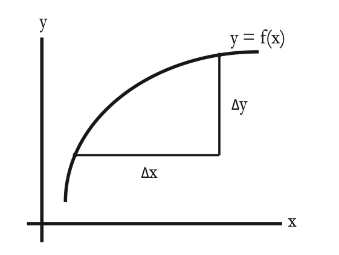

# Session 3-4

## Outline
两章需要掌握的重点有三个。
- rate of change
  - relative change
  - average change -> average speed
- Limits
  - easy limits
  - hard limits
  - left-hand limit
  - right-hand limit
- Continuity
  1. 函数在该点的左右存在极限值
  2. 函数在该点处有定义
  3. 极限值等于函数值 $f(x_0)$

## 1.Rate of Change

$y = f(x)$, if changing x at a certain rate causes y to change, we're interested in the ***relative*** rate of change, $\frac{\Delta y}{\Delta x}$

Another way to think about $\frac{\Delta y}{\Delta x}$ is as the ***average*** change in y over an interval of size $\Delta x$. In this case, the limit 

​														$\frac{dy}{dx} = \lim \Delta x \to 0 \frac{\Delta y}{\Delta x}$

measures the instantaneous rate of change, or the speed. 

## 2.Limits

### Example1

$\lim x \to 3 \frac{x^2+x}{x+1} = \frac{3^2+3}{3+1}= \frac{12}{4} = 3$

This is a **easy limit** by plugging in the limit value. This is because when x is close to 3, the value of the function is close to $f(3)$

### Example2

Some limits are not easy to compute. For example, the definition of the derivative:

​									$\lim x \to x_0 \frac{\Delta f}{\Delta x} = \lim x \to x_0 \frac{f(x_0+\Delta x)-f(x_0)}{\Delta x}$

$\Delta x = 0$ is not allowed. The limit $x \to x_0$ is computed under the implicit assumption that $x \neq x_0$

Other "hard" limits would be:

​										$\lim x \to -1 \frac{x^2+x}{x+1}$ and $\lim x \to \infty \frac{x^2 + x}{x + 1}$

To complete the discussion of limits, we need just one more piece of notation, and concepts of **left hand and right hand limits.**

The limit 	

​															$\lim x \to x_0^+ f(x)$  

is known as the **right-hand limit** and means that you should use values of x that are greater than $x_0$ to compute the limit. Shown below is the graph of the function:

​												$f(x) = x + 1,x > 0$  $f(x) = - x , x \le0$

The right hand limit $\lim x \to 0^+ f(x)$ equals 1

The left hand limit $\lim x \to x_0^- f(x)$ is found by looking at values of f(x) when x is less than $x_0$ , For this function, equals 0.

## 3.Continuity

Definition: A function $f$ is continuous at $x_0$ if $\lim x \to x_0 f(x) = f(x_0)$ .

A function is continuous at $x_0$ has the following properties:

- $\lim x \to x_0^+ f(x) = \lim x \to x_0^- f(x)$ ; in particular, both of these on sided limits exist
- $f(x_0)$ is defined
- $\lim x \to x_0^+ f(x) = \lim x \to x_0^- f(x) = f(x_0)$

when you calculating $\lim x \to x_0 f(x)$, you never allow x to equal to $x_0$
