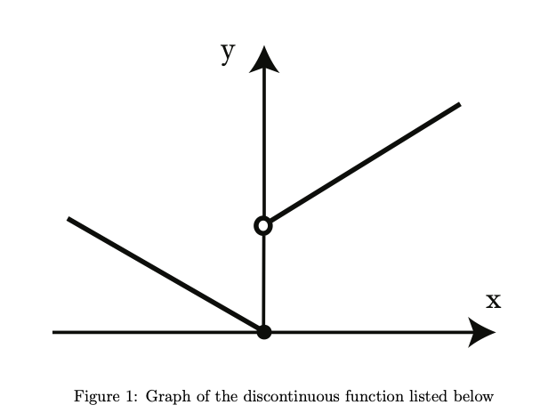
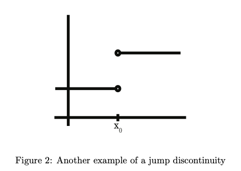
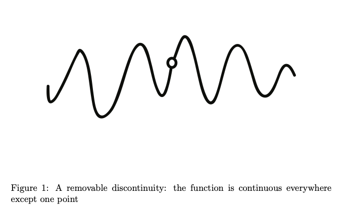
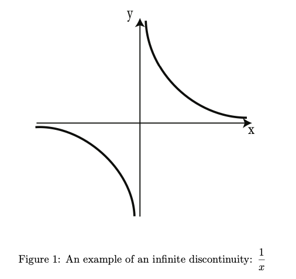
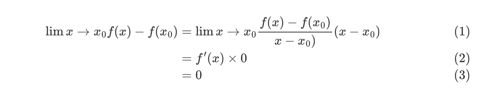

# Session 5-6

## Outline

## Jump Discontinuity

A Jump Discontinuity occurs when the **right-hand and left-hand limits exist but are not equal.**

The graph above is an example of function:

							$f(x) = x + 1 , x > 0$                  $f(x) = -x, x \ge0$. 
		

For x > 0, $\lim x \to 0 f(x) = 1$,but $f(0) = 0$ (One can also say, $f$ is continuous from the left at 0, but not the right)

Another examole in which $\lim x \to x_0^+$ exist, and $\lim x \to x_0^-$ also exists, but they are **NOT equal.**

## Remove discontinuity

At a *removable* discontinuity, **the left-hand and right-hand limits are equal but either the function is not defined or not equal to these limits**:

													$\lim x \to x_0^+ = \lim x \to x_0^- \ne f(x_0)$ 

For example, $g(x) = \frac{sin(x)}{x}$  and $f(x) = \frac{1-cos(x)}{x}$ are defined for $x \ne 0$, but both functions have removable discontinuities. This is not obvious at all, but we will learn later:

										$\lim x \to 0 \frac{sin(x)}{x} = 1$  and $\lim x \to 0 \frac{1-cos(x)}{x} = 0$  

##  Infinite Discontinuity

In an *infinite* discontinuity, **the left- and right-hand limits are infinite**; they may be both positive, both negative or one positive, one negative.

From the graph above, we see that $\lim x \to 0^+ \frac{1}{x} = \infty$ and $\lim x \to 0^- \frac{1}{x} = -\infty$. 

**Even Function -** For a real-valued function f(x), when the output value of f(-x) is the same as f(x), for all values of x in the domain of f, the function is said to be an even function.

**Odd Function -** For a real-valued function f(x), when the output value of f(-x) is the same as the negative of f(x), for all values of x in the domain of f, the function is said to be an odd function.

## Other Discontinuity

we’re not going to worry about them in this course.

## Differentiable Implies Continuous

**Theorem:** If $f$ is differentiatble at $x_0$ , then $f$ is continuous at $x_0$.

Prove:

- We begin to write down what we need to prove; we choose this carefully to make the rest of the proof easier, We want to show that:

													 $\lim x \to x_0 f(x) - f(x_0) = 0$ 

​		This is the same thing as saying that the function is continuous, bucause to prove that a 				function was continuous we'd show that $\lim x \to x_0 f(x) = f(x_0)$ 

- We prove $\lim x \to x_0 f(x) - f(x_0) = 0$  by multiplying and dividing it by the same number, this won't change its value

- Although $x$ gets closer and closer to $x_0$ , it never actually equals $x_0$ , and so we never quite divide by 0. That's what limits are for; $x-x_0$ may be small, but it's always non-zero.
- So this calculation is valid, it's true that $\lim x \to x_0 f(x) - f(x_0) = 0$ , and it's true that differentiable functions are continuous. 

## Introduction to Differentiation

Working toward our goal of "differentiating everything", learn some useful new formulas.

There are two basic types of derivative formulas:

1. Specific Examples: Power rule
2. General Examples: $(u+v)' = u' + v'$ and $(cu)'=cu'$ (where c is a constant)

This lecture focuses on the *basic trig functions*, finding specific formulas for the derivative of the **sine function and the cosine function.**

## Derivative of the Sum of Two Functions

One of our examples of a general derivative formula was:

											 $(u+v)'(x) = u'(x)+ v'(x)$ 

- We apply the definition of derivative to the function $(u+v)(x)$ we get:

								$(u+v)'(x) = \lim \Delta x \to 0 \frac{(u+v)(x+\Delta x) - (u+v)(x)}{\Delta x}$ 

- Since $(u+v)(x)$ is just $u(x)+v(x)$ ,

 
						$(u+v)'(x) = \lim \Delta x \to 0 \frac{u(x+\Delta x)+v(x+\Delta x)-u(x)-v(x)}{\Delta x}$ 

- Combining like terms, we see that:

 
				$(u+v)'(x) = \lim \Delta x \to 0 \frac{u(x+\Delta x) - u(x)}{\Delta x} +\lim \Delta x \to 0 \frac{v(x+\Delta x) - v(x)}{\Delta x}$ 

- The two limits above match the definition of the derivatives of u and v, so we've shown that 

													$(u+v)'(x) = u'(x)+ v'(x)$ 

