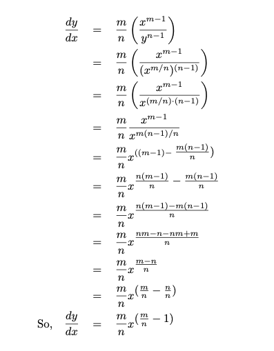

# Session 13-14

## 1.Implicit Differentiation(Rational Exponent Rule)

## 2.Slope of a line tagent to a circle 

### 2.1Direct version

$x^2 + y ^2 = 1$ 

$y = +-\sqrt {1-x^2}$

$y = \sqrt {1-x^2} = (1-x^2)^{1/2}$

Using chain rule => $\frac{dy}{dx} = 1/2u^{-1/2} \times (-2x) = \frac{-1}{\sqrt{1-x^2}} $

### 2.2Implicit version

$x^2 + y ^2 = 1$

$\frac{dy}{dx}(x^2+y^2) = \frac{dy}{dx}(1)$

$\frac{dy}{dx}(x^2) + \frac{dy}{dx}(y^2) = 0$

$2x + 2y \frac{dy}{dx} = 0$

$\frac{dy}{dx} = - \frac{x}{y}$

